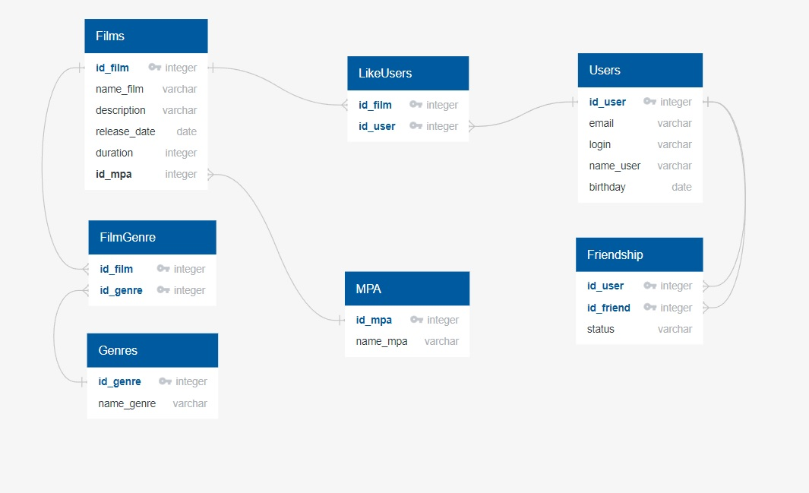

# java-filmorate
-------------
**Данный проект реализован на базе SpringBoot для REST-сервиса, в котором пользователи могут оценивать фильмы, 
оставлять отзывы, добавлять друг друга в друзья и т. д.**

## Приложение предназначено для:
### 1. добавления, изменения, удаления фильмов
### 2. отображения всех фильмов
### 3. поиска популярных фильмов
### 4. добавления, изменения, удаления пользователей
### 5. отображения всех пользователей и их друзей
### 6. поиска общих друзей

## ER-диаграмма


## Примеры запросов
### Получить все фильмы
### http://localhost:8080/films
### Получить фильм с id=1
### http://localhost:8080/films/1
### Получить N популярных фильмов
### http://localhost:8080/films/popular

### Получить всех пользователей
### http://localhost:8080/users
### Получить пользователя с id=1
### http://localhost:8080/users/1
### Получить общих друзей пользователя с id=1 и пользователя с id=2
### http://localhost:8080/users/1/friends/2

## Примеры SQL запросов
``` 
SELECT  u.id_user,
        u.name_user, 
        u.login
FROM user as u
INNER JOIN friendship as fr ON fr.id_friend = u.id_user
WHERE u.id_user=1
```

```
SELECT id_film,
       count(*)
FROM LikeUsers as lu
WHERE f.id_film=1
GROUP BY id_film;
```
## Стек: Java 11, REST, Maven, Lombok, Junit5, Mockito, SQL, взаимодействие с БД через JDBC
## проект создан: AllaSlyusarenko